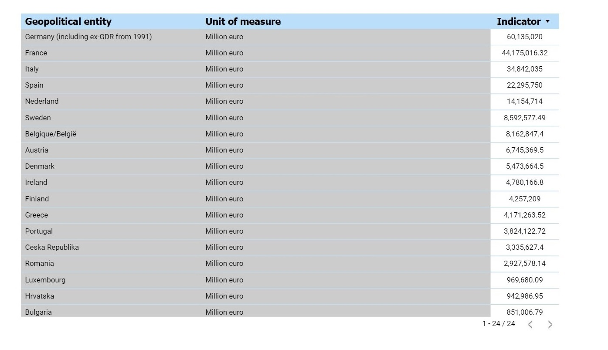
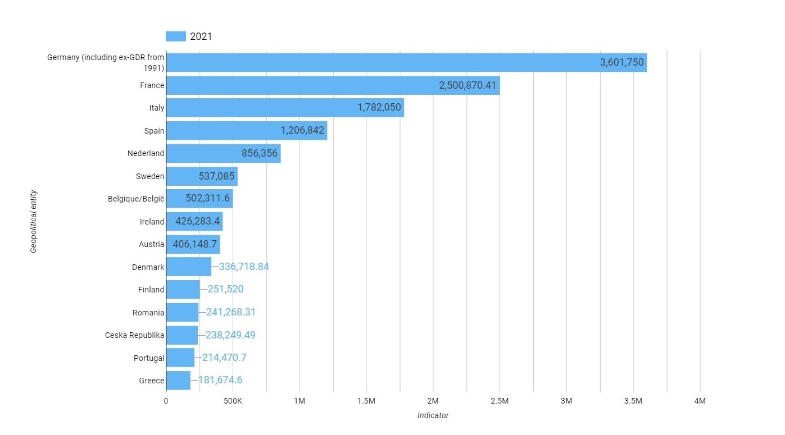
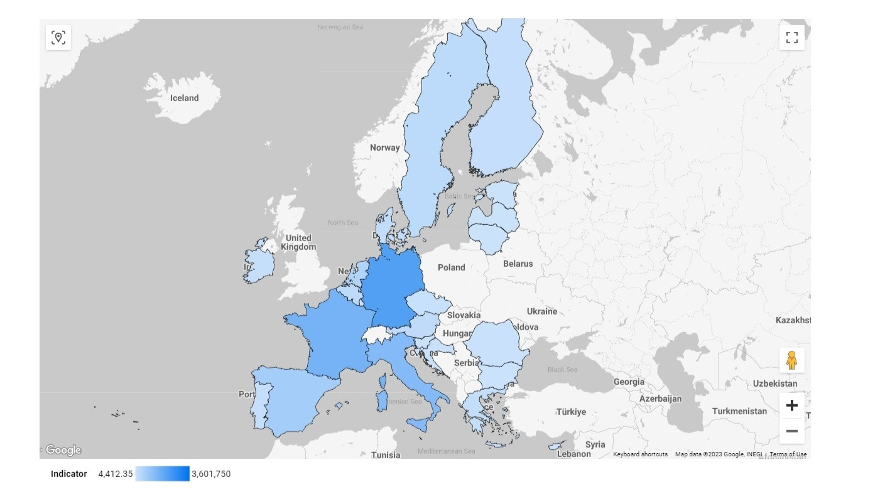

# Overview

This project is related to the processing of the **Eurostat** dataset: `"Gross domestic product (GDP) at current market prices by NUTS 2 regions"`. Eurostat online data code of this dataset: _**NAMA_10R_2GDP**_.
- The dataset is available at this [link.](https://ec.europa.eu/eurostat/web/products-datasets/-/nama_10r_2gdp)
- Metadata regarding this dataset you can find [here.](https://ec.europa.eu/eurostat/cache/metadata/en/reg_eco10_esms.htm)
- API for dataset access description is available at this [link.](https://wikis.ec.europa.eu/display/EUROSTATHELP/Transition+-+from+Eurostat+Bulk+Download+to+API)
- The sourse of the Regions dimension you can find [here.](http://dd.eionet.europa.eu/vocabulary/eurostat/sgm_reg/view)
- The sourse of the Units dimension you can find [here.](http://dd.eionet.europa.eu/vocabulary/eurostat/unit/)

## Technologies and Tools

- Cloud: Google Cloud Platform
- Infrastructure as Code: Terraform
- Containerization: Docker
- Workflow Orchestration: Airflow
- Data Lake: Google Cloud Storage
- Data Warehouse: BigQuery
- Data Modeling and Transformations: dbt
- Data Visualization: Looker Studio
- Language: Python 

## Data Architecture

The data pipeline naturally consists of data ingestion stage, data transformation and visualization stages.

**Data ingestion** stage comprise the following activities:
- Download the corresponding dataset from the **Eurostat site**.
- Upload this dataset into the Google Cloud Storage in the **Data lake**.
- Load this dataset form the Data Lake into the BigQuery dataset in the **Data Warehouse** in the staging schema that contains raw source data.

During the **Data ransformation** stage the data is carried over through the various transformations from the Raw data schema to the production Data Warehouse schema. The project uses Google BigQuery as a **Data Warehouse**. This process is implemented using the [dbt Cloud](https://www.getdbt.com/product/dbt-cloud).  

**Data visualization**.
- The dashboard used in this project was created in the Google Looker Studio. 
- The Looker Studio is treated in the project as Front-End visualization tool only. All table joins and other data modeling actions, required for the visualization, were made by the dbt Cloud.
- Due to the fact that Looker Studio Google Geo charts [doesn't support NUTs regions](https://support.google.com/looker-studio/answer/9843174#country&zippy=%2Cin-this-article), the "Map" page of the dashbord represents data for Country level regions only. The details regarding the NUTs regions you can find [here.](https://ec.europa.eu/eurostat/web/nuts/background)
- The dashbord is based on the dataset `eurostat_gdp_prod_core.facts_gdp_joined` from the corresponding `DB Prod` Data Warehouse environment.
- **The restricted (by login/password) link at the dashboard located** [**here.**](https://lookerstudio.google.com/reporting/5cb1caed-76fb-4a2f-bbd3-b9e2bb8269b1) This link is restricted in order to avoid additional charging.
 
The architecture details notes you can find [here.](./notes/architecture_notes.md)

## Data Visualization

The dashboard consist of tree pages: Table, Bar, Map.

**Table**:

**Bar**:

**Map**:

# Prerequisites

The following items could be treated as prerequisites in order to reproduce the project:

- An active [GCP account.](https://cloud.google.com)
- Installed Docker Desktop
- (Optional) A SSH client. It is supposed that you are using a Terminal and SSH.

# How to Run This Project

1. Set up project environment. The details you can find in [this note](./notes/setup_notes.md).
2. Perform data ingestion:
   - On the **local machine**:
      - Run Docker Desktop
      - `cd eurostat-gdp-airflow/airflow`
      - Run Airflow: `docker-compose up -d`
      - Access the Airflow GUI by browsing to `localhost:8080`. Username and password are both `airflow` .
      - Run **ingestion_dag**
    - In your Google Cloud project go to **Cloud Storage** and open the corresponding bucket. You should see the file `eurostat_gdp.csv` there.
    - In your Google Cloud project go to **Big Query** and open the dataset `eurostat_gdp_raw`. You should see the table `nama-10r-2gdp` there.
3. Perform data transformation
   - The details you can find [here](./notes/dbt_notes.md#the-project-team-workflow)

