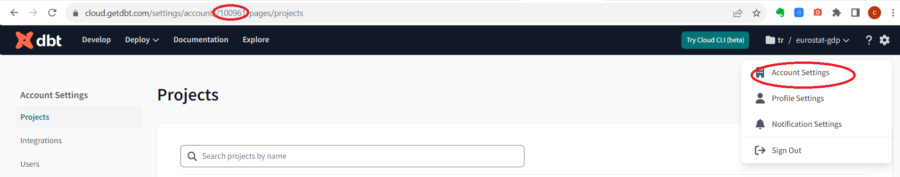

# Index

- [Dataset](#dataset)
- [Technologies and Tools](#technologies-and-tools)
- [Data Pipeline Architecture](#data-pipeline-architecture)
  - [Local Machine](#local-machine)
  - [Cloud Infrastructure with Terraform](#cloud-infrastructure-with-terraform)
  - [Orchestration](#orchestration)
    - [Prefect Cloud](#prefect-cloud)
      - [Prefect Blocks](#prefect-blocks)
      - [Prefect Deployment](#prefect-deployment)
    - [Prefect execution environment: Docker, Google Artifact Registry, Google Cloud Run](#prefect-execution-environment-docker-google-artifact-registry-google-cloud-run)
    - [Prefect Agent and GCP VM instance](#prefect-agent-and-gcp-vm-instance)  
- [Data Ingestion and Data Lake](#data-ingestion-and-data-lake)
- [Data Transformation and Data Warehouse](#data-transformation-and-data-warehouse)
- [Data Visualization](#data-visualization)
- [Set up project environment](#set-up-project-environment)
  - [Prerequisites](#prerequisites)
  - [Create a GCP project](#create-a-gcp-project)
  - [Setup local development environment](#setup-local-development-environment)
    - [Install and setup Google Cloud SDK on local machine](#install-and-setup-google-cloud-sdk-on-local-machine)
    - [Clone the project repo on local machine](#clone-the-project-repo-on-local-machine)
    - [Install Airflow on local machine](#install-airflow-on-local-machine)
    - [Install Terraform on local machine](#install-terraform-on-local-machine)
    - [Set up SSH access to the Compute Engine VM instances on local machine](#set-up-ssh-access-to-the-compute-engine-vm-instances-on-local-machine)
  - [Create GCP project infrastructure with Terraform](#create-gcp-project-infrastructure-with-terraform) 
  - [Build Docker image and put it in the Artifact Registry](#build-docker-image-and-put-it-in-the-artifact-registry)  
  - [Create Prefect Cloud Blocks](#create-prefect-cloud-blocks)
  - [Create Prefect Deployment](#create-prefect-deployment)


# Dataset

- This project is related to the processing of the **Eurostat** dataset: `"Gross domestic product (GDP) at current market prices by NUTS 2 regions"`. Eurostat online data code of this dataset: _**NAMA_10R_2GDP**_.
- The dataset is available at this [link.](https://ec.europa.eu/eurostat/web/products-datasets/-/nama_10r_2gdp)
- Metadata regarding this dataset you can find [here.](https://ec.europa.eu/eurostat/cache/metadata/en/reg_eco10_esms.htm)
- API for dataset access description is available at this [link.](https://wikis.ec.europa.eu/display/EUROSTATHELP/Transition+-+from+Eurostat+Bulk+Download+to+API)
- The sourse of the Regions dimension you can find [here.](http://dd.eionet.europa.eu/vocabulary/eurostat/sgm_reg/view)
- The sourse of the Units dimension you can find [here.](http://dd.eionet.europa.eu/vocabulary/eurostat/unit/)


# Technologies and Tools

- Cloud: Google Cloud Platform
- Infrastructure as Code: Terraform
- Containerization: Docker
- Workflow Orchestration: Airflow
- Data Lake: Google Cloud Storage
- Data Warehouse: BigQuery
- Data Modeling and Transformations: dbt
- Data Visualization: Looker Studio
- Language: Python 


# Data Pipeline Architecture


## Local Machine 
[To Index](#index)

In the project architecture a local machine is used in order to create the project infrastructure in the Cloud, to create a Docker image for the Airflow and as a host for the Airflow.

So, on the local machine the following software should be installed:
- Python
- Google Cloud SDK
- Git
- Terraform 
- Docker

The details see in the section [Setup local development environment](#setup-local-development-environment).


## Cloud Infrastructure with Terraform
[To Index](#index)

The GCP Cloud Infrastructure in the project was implemented using the Terraform.
The Cloud Infrastructure created by Terraform includes the following items:

- Cloud Storage bucket
- BigQuery dataset
- Virtual Machine instance
- Artifact Registry

Terraform configuration located in the repo by the path: `eurostat-gdp/setup/terraform/`  
To get more details regarding the Terraform configuration files see [the official documentation](https://developer.hashicorp.com/terraform/language/modules/develop/structure).

The Terraform configuration in the project consists of the following files:

- **main.tf**. This file contains the main set of configuration for the project.
- **variables.tf**. This file contains the declarations for variables used in the Terraform configuration.
- **terraform.tfvars**. This file specifies the values for the Terraform variables from the file `variables.tf` which contain private information and should be provided during project setup individually.

Let's review these files briefly. 


### main.tf

This file consists of blocks. The syntax of these blocks you can review in the [Terraform official documentation](https://developer.hashicorp.com/terraform/language/resources/syntax).
- The first block **_terraform_** contains the minimal Terraform version required and the backend to be used.
- The block **_provider_** defines the service provider and the project information.
- The block **_resource "google_storage_bucket"_** defines all required information in order to create Google Cloud storage bucket resource. The structure of this block you can find in the official documentation [here](https://registry.terraform.io/providers/hashicorp/google/latest/docs/resources/storage_bucket).
- The block **_resource "google_bigquery_dataset"_** defines all required information in order to create Google BigQuery dataset resource. The structure of this block you can find in the official documentation [here](https://registry.terraform.io/providers/hashicorp/google/latest/docs/resources/bigquery_dataset).
- The block **_resource "google_artifact_registry_repository"_** defines all required information in order to create Google Artifact registry for containers. The structure of this block you can find in the official documentation [here](https://registry.terraform.io/providers/hashicorp/google/latest/docs/resources/artifact_registry_repository).
- The block **_resource "google_compute_instance"_** defines all required information in order to create a Google VM instance resource within Compute Emgine. The structure of this block you can find in the official documentation [here](https://registry.terraform.io/providers/hashicorp/google/latest/docs/resources/compute_instance).
  - The values for this block were provided in accordance with with the GCP Free Tier limitations
  - The value for the argument `image` you can find using the following command, f.e. : `gcloud compute images list | grep ubuntu`
  - Some considerations regarding the Servive Account for the VM instance you can find in the [official documentation](https://cloud.google.com/compute/docs/access/service-accounts#default_service_account).
  - Be aware, that after the creation Terraform starts the created VM. So, if you are not going to work further now - don't forget to stop the VM to avoid unnecessary fees.


### variables.tf

This file contains the declarations for Terraform variables. It contains blocks also. 
Each block contains the name of the variable, the type, description and a default value for the variable if required. 
In this project the values for the variables were assigned through the defalt values in this file. Meanwhile, there are [other approaches](https://developer.hashicorp.com/terraform/language/values/variables) exist.

- `variable "gcp_project_id"`. Your own GCP Project ID. The value for this variable is not specified. This value should be entered in the file `terraform.tfvars`.
- `variable "ce_service_account_email"`. This is email identifier for your default Service Accaount, which is used by the Compute Engine service. The value for this variable is not specified. This value should be entered in the file `terraform.tfvars`. 
- `variable "region"`. The value for this variable specified taking into account the GCP free tier requirements.
- `variable "data_lake_bucket"`. The value for this variable specified the name of the Cloud Storage bucket that should be created.
- `variable "raw_bq_dataset"`. The value for this variable specified the name of the BigQuery dataset that should be created.
  - Be aware that this value must be alphanumeric (plus underscores). 
- `variable "registry_id"`. The value for this variable specified the name of the Artifact repository that should be created.  
  - Be aware that this value may only contain lowercase letters, numbers, and hyphens, and must begin with a letter and end with a letter or number.
  - `variable "vm_script_path"`. This variable contains the path to the script which install the required packages on the VM and which should be run on the Virtual Machine compute instance just after of its creation by Terraform.
  - `variable "ssh_user_name"`. This variable contains the name of the user that will be used to remote exec the script specified in the variable `vm_script_path` trough ssh.
  - `variable "ssh_private_key_path"`. This variable contains the path to the private ssh key which is used to connect to the VM instance.


### terraform.tfvars

This file specifies the values for the variables from the file `variables.tf` which contain private information and should be provided during project setup individually.

- `gcp_project_id`.  You can find this value on the your GCP Project Dashboard.
- `ce_service_account_email`. This value you can find in your GCP console: IAM & Admin -> Service Accounts. Find the account with the name "Compute Engine default service account" and take its email.
- `ssh_user_name`.  Insert your own value here.
- `ssh_private_key_path`. Insert the value, which your provided when you created the SSH key pair on your local machine.

The guidance regarding the Terraform execution see in the corresponding section:  [Create GCP project infrastructure with Terraform](#create-gcp-project-infrastructure-with-terraform) 


## Orchestration
[To Index](#index)

The Orchestration in the project is implemented using the [Prefect](https://docs.prefect.io/latest/getting-started/quickstart/#quickstart) tool, actually [Prefect Cloud](https://docs.prefect.io/latest/cloud/) version of this tool. 

The Orchestration is implemented only for the Data Ingestion stage. The Orchestration for the Transformation stage (for dbt transformations) is not implemented due to the dbt free pricing plan limitations (API access is not available for the dbt free pricing plan).

There are many variants how to make Orchestration using the Prefect. The following orchestration variant was implemented in the project:  
- Prefect server - cloud based hosting - Prefect Cloud.
- Prefect flows Python scripts, which contain the orchestration logic, are located in the separate GitHub repository, outside the Prefect server.
- Prefect execution environment is implemented using Docker image which is stored in the Google Artifact Registry and Google Cloud Run service.
- Prefect Agent is running in the Compute Engine Virtual Machine instance.


### Prefect Cloud

Much of Prefect's functionality is backed by an API that located on the  _**Prefect server**_. 
There are two versions of Prefect server: self-hosting and Prefect Cloud.
- If self-hosting, you'll need to start the Prefect webserver and related services yourself.
- If Prefect Cloud, you'll need only to sign up for a forever free Prefect Cloud account.

The project uses Prefect Cloud version. [Prefect Cloud](https://docs.prefect.io/2.13.5/cloud/) is a workflow orchestration platform that provides all the capabilities of _**Prefect server**_ plus additional features.


#### Prefect Blocks

In order to perform orchestration Prefect server should have information about all components of the system.   
[Prefect blocks](https://docs.prefect.io/2.13.5/concepts/blocks/) is a Prefect feature that enable the storage of configuration and provide an interface for interacting with external systems.

The project uses the following Prefect Block types:
- [GCP Credentials](https://prefecthq.github.io/prefect-gcp/credentials/#prefect_gcp.credentials.GcpCredentials). Block used to manage authentication with GCP. 
- [GCS Bucket](https://prefecthq.github.io/prefect-gcp/cloud_storage/#prefect_gcp.cloud_storage.GcsBucket). Block used to store f configuration regarding the GCP Cloud Storage Buckets.
- [BigQuery Warehouse](https://prefecthq.github.io/prefect-gcp/bigquery/#prefect_gcp.bigquery.BigQueryWarehouse). A block for querying a database with BigQuery.
- [Secret](https://discourse.prefect.io/t/how-to-securely-store-secrets-in-prefect-2-0/1209). A block to secure store project id value.
- [GitHub](https://docs.prefect.io/2.13.5/concepts/filesystems/#github). The GitHub filesystem block enables interaction with GitHub repositories. This block is read-only and works with both public and private repositories.
- [GCP Cloud Run Job](https://prefecthq.github.io/prefect-gcp/cloud_run/#prefect_gcp.cloud_run.CloudRunJob). Infrastructure block used to run GCP Cloud Run Jobs. This block contains all information required to run Perfect flows, namely:
    - Docker Image name - the full location of the Docker image in the Google Artifact Registry
    - GCP Credentials block

The Prefect blocks in the project are created through the Python scripts. These scripts are located in the `eurostat-gdp/setup/blocks` folder.

Implementation details see in the section [Create Prefect Cloud Blocks](#create-prefect-cloud-blocks).


#### Prefect Deployment

[Prefect Deployments](https://docs.prefect.io/2.13.6/concepts/deployments/) are server-side representations of Prefect flows. They store the all metadata needed for remote orchestration including when, where, and how a workflow should run. So, a deployment allows to trigger and schedule Prefect flows instead of running them manually.

Prefect CLI is used in the project for the deployment creation.
In order to create Prefect deployment on the Prefect Server we need to run two commands on the local machine:
- `prefect deployment build ...` - [this command](https://docs.prefect.io/2.13.6/api-ref/prefect/cli/deployment/) will create a deployment yaml file. 
- `prefect deployment apply ...` - this command will create and upload the deployment, specified in the yaml file, to the Prefect server.

Implementation details see in the section [Create Prefect Deployment](#create-prefect-deployment).


### Prefect execution environment: Docker, Google Artifact Registry, Google Cloud Run

To run Prefect workflows scripts in the Cloud an execution environment is required. 
In the project such execution environment consists of two parts: **Docker image** which is stored in the **Google Artifact Registry** and **Google Cloud Run**.
- Docker image contains the base environment for execution: Python, Prefect and all required dependencies that should be installed in the base environment in the Docker image. 
- [GCP Artifact Registry.](https://cloud.google.com/artifact-registry/docs/docker/store-docker-container-images#auth) is used to store the Docker image. 
- [Google Cloud Run](https://cloud.google.com/run/?hl=en) is used to run the corresponding Docker container.

**Be aware of the following**_:  
  - The Docker image contains _**only base environment for Prefect execution**_: Python, Prefect, etc.
  - The Prefect _**flows scripts**_ itself are located in the corresponding _**GitHub repository**_.
  - The code requred to build the Docker image is located in the `setup/docker` folder in the project repo.
  - All environment dependencies are captured in the `setup/docker/docker-requirements.txt` file and will be installed in the base environment in the Docker image.
  - The implementation details see in the section [Build Docker image and put it in the Artifact Registry](#build-docker-image-and-put-it-in-the-artifact-registry)


### Prefect Agent and GCP VM instance

The [Prefect agent](https://docs.prefect.io/2.13.5/concepts/agents/) is a lightweight polling service that periodically check scheduled flow runs from a Prefect Server work pool (located in the Prefect Cloud) and execute the corresponding Prefect flow runs. Agents poll for work every 15 seconds by default. 

In the project architecture the Prefect agent is running on a Google Compute Engine VM instance. 
- The creation of this part of the architecture completly implemented using Terraform (see the corresponding section [Cloud Infrastructure with Terraform](#cloud-infrastructure-with-terraform)
- The code that _**creates the VM instance**_ is located in the `setup/terraform/main.tf` file in the section `resource "google_compute_instance"`.
- The script that _**installs the Python and Prefect Agent**_ on the created VM instance and _**connects it to the Prefect Cloud**_ with Prefect API key is located in the `setup/terraform/scripts/install.sh` file.
- The code that runs the mentioned script `setup/terraform/scripts/install.sh` is located in the `setup/terraform/main.tf` file in the section `provisioner "remote-exec"`.


# Data Ingestion and Data Lake
[To Index](#index)

Data Ingestion stage comprise the following activities:
- Download the corresponding dataset from the **Eurostat site**.
- Upload this dataset into the Google Cloud Storage in the **Data lake**.
- Load this dataset form the Data Lake into the BigQuery dataset in the **Data Warehouse** in the schema that contains raw source data.  

Prerequisites: you should complete all required activities mentioned in the section [Set up project environment](#set-up-project-environment).

In order to fulfil Data Ingestion stage do the following:

- On the **local machine**:
  - Start the corresponding VM instance in the Google Cloud, run the command: `gcloud compute instances start eurostat-gdp-vm-instance`
  - Connect through SSH to the VM instance:  
    - `cd ~/.ssh`
    - `gcloud compute config-ssh`
    - run the command that is provided in the output of the previous command: `ssh eurostat-gdp-vm-instance.us-east1-b.<your-google-projet-id>`, where <your-google-projet-id> - the value specific for your own environment  

- On the **VM instance**:
  - Start the Prefect Agent on the VM instance: `prefect agent start -q default`  

- On the **Prefect Cloud**
  - Login to your Prefect Cloud account
  - Go to the Deployments tab and find the Deployment `ingest-data/ingest_euro_gdp_data`
  - Select this deployment and perform `Quick run` action


# Data Transformation and Data Warehouse
[To Index](#index)

The project uses Google BigQuery as a **Data Warehouse**. 
During the Data Transformation stage the data is carried over through the various transformations from the Raw data schema to the production Data Warehouse schema.  
This process is implemented using the [dbt Cloud](https://www.getdbt.com/product/dbt-cloud).  

The Data Transformation implementation details, Data Warehouse Modeling guidance and the corresponding workflow you can find [here.](./notes/dbt_notes.md)


# Data Visualization
[To Index](#index)

- The dashboard used in this project was created in the Google Looker Studio. 
- The Looker Studio is treated in the project as Front-End visualization tool only. All table joins and other data modeling actions, required for the visualization, were made by the dbt Cloud.
- Due to the fact that Looker Studio Google Geo charts [doesn't support NUTs regions](https://support.google.com/looker-studio/answer/9843174#country&zippy=%2Cin-this-article), the "Map" page of the dashbord represents data for Country level regions only. The details regarding the NUTs regions you can find [here.](https://ec.europa.eu/eurostat/web/nuts/background)
- The dashbord is based on the dataset `eurostat_gdp_prod_core.facts_gdp_joined` from the corresponding `DB Prod` Data Warehouse environment.
- **The restricted (by login/password) link at the dashboard located** [**here.**](https://lookerstudio.google.com/reporting/5cb1caed-76fb-4a2f-bbd3-b9e2bb8269b1) This link is restricted in order to avoid additional charging. 

The dashboard screenshots and visualizations you can find [here.](./notes/dashboard_notes.md)


# Set up project environment


## Prerequisites
[To Index](#index)

The following items could be treated as prerequisites in order to reproduce the project:

- An active [GCP account.](https://cloud.google.com)
- Installed Docker Desktop
- (Optional) A SSH client. It is supposed that you are using a Terminal and SSH.


## Create a GCP project
[To Index](#index)

- To create a new Google Cloud project go to the [GCP dashboard](https://console.cloud.google.com/) and create a new project.
- After you have created the project, you need to create a _Service Account_ in the project: 
  - ***IAM & Admin -> Service Accounts -> Create Service Account***
  - Enter the following information:
    - _***Service Account ID***_. Provide `your own value` or hit `Generate` link.
    - Grant this service account access to the project with the following roles:
      - `BigQuery Admin`
      - `BigQuery Job User`
      - `Storage Admin`
      - `Storage Object Admin`
      - `Cloud Run Admin`
      - `Service Account User`
      - `Secret Manager Admin`
      - `Viewer`
      - `Editor`
- After that create the Service Account credentials file.
  - **Service Account** -> **Manage Keys** -> **Add Key** -> **Create new key**  
  - Chose Key type: `JSON`
- Download the created Service Account credentials file to the **local machine** and store it in your home folder, i.e. in the `$HOME/.google/`.
- Create an environment variable `GOOGLE_APPLICATION_CREDENTIALS` on the **local machine** and assign to it the path to the your json Service Account credentials file
  - Open your .bashrc file: `nano .bashrc`
  - At the end of the file, add the following row: `export GOOGLE_APPLICATION_CREDENTIALS="$HOME/.google/<your_credentials>.json"`  
  - Save you changes and close nano: `ctrl+O, ctrl+X`
  - Log out of your current terminal session and log back in, or run `source ~/.bashrc` to activate the environment variable.
- Then activate the following APIs in your GCP project:  
  - [Identity and Access Management (IAM) API](https://console.cloud.google.com/apis/library/iam.googleapis.com)
  - [IAM Service Account Credentials API](https://console.cloud.google.com/apis/library/iamcredentials.googleapis.com)
  - [Compute Engine API](https://console.cloud.google.com/apis/library/compute.googleapis.com)
  - [Artifact Registry API](https://console.cloud.google.com/apis/library/artifactregistry.googleapis.com)
  - [Cloud Storage API](https://console.cloud.google.com/apis/library/storage.googleapis.com)
  - [BigQuery API](https://console.cloud.google.com/apis/library/bigquery.googleapis.com)
  - [Cloud Run API](https://console.cloud.google.com/apis/library/run.googleapis.com)


## Setup local development environment
[To Index](#index)

### Install and setup Google Cloud SDK on local machine

- Download Google Cloud SDK from [this link](https://cloud.google.com/sdk/docs/install-sdk#linux) and install it.
- Initialize the SDK following [these instructions.](https://cloud.google.com/sdk/docs/install-sdk)
  - Run `gcloud init` from a terminal and follow the instructions:
    - The system will generate a link and will ask you to go to the link in your browser.
    - When you will go to this link Google will generate the verification code in gcloud CLI on the machine you want to log into.
    - Copy this code and paste it into your terminal window prompt. 
  - Make sure that your project is selected with the command `gcloud config list`

### Clone the project repo on local machine

- Fork this GitHub repository in your GitHub account and clone the forked repo. It is requred because you should perform some customization changes in the code.  
- Go to the your `$HOME` directory.
- Run the following command: `git clone https://github.com/<your-git-account-name>/eurostat-gdp.git`

### Install Airflow on local machine

1. Go to the `eurostat-gdp-airflow/airflow` and update `docker-compose.yaml` file.
  - under the section `x-airflow-common:`
  - update the env variable `GOOGLE_APPLICATION_CREDENTIALS`. Replace <google_credentials.json> value by your own credentials file name. It is supposed that your credentials file laid in the /.google folder.
  - update the env variable `GCP_PROJECT_ID`. Replace <gcp_project_id> value by your own project_id value.
  - update the env variable `GCP_GCS_BUCKET`. Replace <gcs_bucket_name> value by your own gcs_bucket_name value. It is supposed that the bucket name should be in the format: `eurostat_gdp_data_lake_<your_gcp_project_id>`.
2. Run Docker Desktop
3. `cd eurostat-gdp-airflow/airflow`
4. Build the image. It may take several minutes You only need to do this the first time you run Airflow or if you modified the Dockerfile or the `requirements.txt` file.
    ```bash
    docker-compose build
    ```
5. Initialize Airflow environment:
    ```bash
    docker-compose up airflow-init
    ```
6. Run Airflow
    ```bash
    docker-compose up -d
    ```
7. You may now access the Airflow GUI by browsing to `localhost:8080`. Username and password are both `airflow` .
>***IMPORTANT***: this is ***NOT*** a production-ready setup! The username and password for Airflow have not been modified in any way; you can find them by searching for `_AIRFLOW_WWW_USER_USERNAME` and `_AIRFLOW_WWW_USER_PASSWORD` inside the `docker-compose.yaml` file.

### Install Terraform on local machine

- Terraform client installation: [https://www.terraform.io/downloads](https://www.terraform.io/downloads)  
  - `wget -O- https://apt.releases.hashicorp.com/gpg | sudo gpg --dearmor -o /usr/share/keyrings/hashicorp-archive-keyring.gpg`
  - `echo "deb [signed-by=/usr/share/keyrings/hashicorp-archive-keyring.gpg] https://apt.releases.hashicorp.com $(lsb_release -cs) main" | sudo tee /etc/apt/sources.list.d/hashicorp.list`
  - `sudo apt update && sudo apt install terraform`
- Check that Terraform installed successfully. Run: `terraform -version`

  
### Set up SSH access to the Compute Engine VM instances on local machine

- **Create an SSH key pair on local machine.**  
  - If you connect to GCP Compute Engine virtual machine (VM) instances using third party tools or OpenSSH, you need to add a key to your VM before you can connect. If you don't have an SSH key, you must create one.
  - Create SSH key pair in accordance with the following GCP guidance: [Create SSH keys](https://cloud.google.com/compute/docs/connect/create-ssh-keys)  
    - Open a terminal window and run the following command: `ssh-keygen -t rsa -f ~/.ssh/<key_file_name> -C <user_name> -b 2048`, where:   
      - <key_file_name>: the name for your SSH key file, replace it by your own value  
      - <user_name>: your username on the VM, replace it by your own value  
    - This comand will create two files in the .ssh folder: <key_file_name> (private key) and <key_file_name>.pub (public key)
- **Upload the created ssh public key to GCP Compute Engine.**     
  - Copy the content of the <key_file_name>.pub  
  - Go to the your `GCP project console -> Compute Engine -> Settings -> Metadata -> SSH keys -> Add SSH Key`.
  - Insert the copied content of the <key_file_name>.pub -> Save.
  - All instances in this project will use this ssh key.
- **Cnfigure SSH access on the local machine.**
  - Make sure that the gcloud SDK is configured for your project:
    - Run `gcloud config list` to see your active gcp configuration details.
    - If you have multiple google accounts but the active configuration does not match the account you want - run the following command: `gcloud config configurations activate my-account`
    - If the active configuration matches your account but points to a different project - run the following command: `gcloud config set project my-project`
  - Start the created VM instance in the Google Cloud dashboard.
  - Go to the ~/.ssh folder and run `gcloud compute config-ssh`
    - This comand creates `~/.ssh/config` file for your ssh gcp connection
    - If you did not have already a SSH key, a pair of public and private SSH keys, this command will create them.
    - The output of this command will provide you the host name for the ssh connection to your instance in the format: `<instance>.<zone>.<project>`.
    - Now you should be able to open the SSH connection to your VM instance: `ssh <instance>.<zone>.<project>`
  - **You should run this command** `gcloud compute config-ssh` **each time when your VMs instances are stopped and started again** in order to update `~/.ssh/config` file and set up new value for External IP for your instance. This IP is changed every time when the instance stopped and restart again.
  - Thease are some other usefull gcloud SDK commands:
    - `gcloud compute instances list` - provides a list of your available instances
    - `gcloud compute instances start <instance_name>` - starts your instance
    - `gcloud compute instances stop <instance_name>` - stops your instance


## Create GCP project infrastructure with Terraform
[To Index](#index)

Run the following commands:
- `cd ~/eurostat-gdp-airflow/terraform`
- edit a file `terraform.tfvars` - insert your own values for the variables here.
- `terraform init`
- `terraform plan`
- `terraform apply`
- Go to the your GCP dashboard and make sure that the following resourses were created:
  - [Cloud Storage bucket](https://console.cloud.google.com/storage): `eurostat_gdp_data_lake_<your_gcp_project_id>`
  - [BigQuery dataset](https://console.cloud.google.com/bigquery): `eurostat_gdp_raw`


## Build Docker image and put it in the Artifact Registry
[To Index](#index)

- All actions are performed on the local machine.
- Run Docker Desktop.
- [Configure Docker to use the Google Cloud CLI to authenticate requests to Artifact Registry](https://cloud.google.com/artifact-registry/docs/docker/store-docker-container-images#auth).
  - To set up authentication to Docker repositories in the region us-east1, run the following command: `gcloud auth configure-docker us-east1-docker.pkg.dev`
- `cd eurostat-gdp/setup/docker`
- Build the Docker image: `docker build -t eurostat-gdp:v1 .`
- Before you push the Docker image to Artifact Registry, you must [tag it with the repository name](https://cloud.google.com/artifact-registry/docs/docker/store-docker-container-images#tag). Run the following command:  
  - `docker tag eurostat-gdp:v1 us-east1-docker.pkg.dev/<gcp_project_id>/eurostat-gdp-repository/eurostat-gdp:v1` , where:
    - us-east1-docker.pkg.dev - is the hostname for the Docker repository you created.
    - **<gcp_project_id>** - is your Google Cloud project ID. You should enter your value here.
    - eurostat-gdp-repository - is the name of the repository you created
    - eurostat-gdp:v1 - is the image name you want to use in the repository. 
- Push the Docker image to the registry: `docker push us-east1-docker.pkg.dev/<gcp_project_id>/eurostat-gdp-repository/eurostat-gdp:v1`
  - **<gcp_project_id>** - is your Google Cloud project ID. You should enter your value here.
- Open your [Artifact Registry](https://console.cloud.google.com/artifacts) and check that the Docker image exists in the repository.


## Create Prefect Cloud Blocks
[To Index](#index)
 
- `cd eurostat-gdp`
- Rename the file `.env_template` to `.env`.
- Open .env file and add assignments for all variables in the .env file providing your own values: 
  - `SERVICE_ACCOUNT_CREDENTIALS`. It is the json file with GCP service account credentials, that you have already created in the section [Create a GCP project](#create-a-gcp-project).  In order to get the value for this variable  you need to convert the corresponding json file to the string beforehand:  
    - run python interpreter: `python`
    - `import json`
    - `service_key ={enter here your json}`
    - `service_key = json.dumps(service_key)`
    - `print(service_key)`
    - copy this value from the output and assing it to the `SERVICE_ACCOUNT_CREDENTIALS` variable in the .env file  
  - `DBT_CLOUD_ACCOUNT_ID`. To get this value you should login to the your dbt Cloud account, go to Account Settings, and in the URL, you should see the your dbt Cloud account ID. 
    
  - `DBT_CLOUD_API_KEY`. To get this value you should login to the your dbt Cloud account, go to _**Profile Settings**_ -> _**API**_ -> _**API Key**_.
- Run the command: `python setup.py`
- Open your Prefect Cloud account, go to the _**Blocks**_ tab and check, that the following blocks were created:
  - GCP Credentials block with the name: `eurostat-gdp-gcp-creds`
  - GCS Bucket block with the name: `eurostat-gdp-gcs-bucket`
  - GitHub block with the name: `eurostat-gdp-github`
  - Secret block with the name: `project-id`

Create block GCP Cloud Run Job. It is an infrastructure block used to run GCP Cloud Run Jobs. Because this block is experimental and the interface may change without notice, we create this block mannually through Prefect Cloud UI.
- Open your Prefect Cloud account, go to the _**Blocks**_ tab and create new _**GCP Cloud Run Job**_ block
- Enter the following information:
  - Block name: `eurostat-gdp-cloud-run`
  - Type: `cloud-run-job`
  - Image Name: `us-east1-docker.pkg.dev/<your-gcp-project-id>/eurostat-gdp-repository/eurostat-gdp:v1`
  - Region: `us-east1`
  - GcpCredentials: `eurostat-gdp-gcp-creds`
- Save the changes


## Create Prefect Deployment
[To Index](#index)

Run the following commands on the local machine:

- `cd eurostat-gdp`
- `prefect deployment build flows/ingest_data.py:ingest_data -n ingest_euro_gdp_data -sb github/eurostat-gdp-github -ib cloud-run-job/eurostat-gdp-cloud-run -o deploy_euro_gdp_data`

    where:

    - `flows/ingest_data.py:ingest_data` - the path to a flow entrypoint, in the form of ./path/to/file.py:flow_func_name.
    - `-n ingest_euro_gdp_data` - the name to give the deployment.
    - `-sb github/eurostat-gdp-github`- the name of the remote storage block of the flow code (Use the syntax: 'block_type/block_name') , in our case it is GitHub block.
    - `-ib cloud-run-job/eurostat-gdp-cloud-run` - the name of the infrastructure block, in our case - Cloud Run block.
    - `-o deploy_euro_gdp_data` - the name of the deployment yaml file that will be created.

- `prefect deployment apply deploy_euro_gdp_data.yaml`
- Go the your Prefect Cloud account -> Deployments, and check, that the deployment `ingest-data/ingest_euro_gdp_data` was created.
