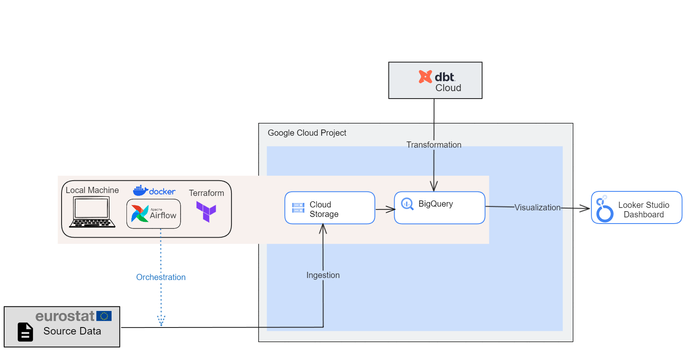

# Index

- [Dataset](#dataset)
- [Technologies and Tools](#technologies-and-tools)
- [Data Pipeline Architecture](#data-pipeline-architecture)
  - [Local Machine](#local-machine)
  - [Cloud Infrastructure with Terraform](#cloud-infrastructure-with-terraform)
  - [Orchestration](#orchestration)
- [Data Ingestion and Data Lake](#data-ingestion-and-data-lake)
- [Data Transformation and Data Warehouse](#data-transformation-and-data-warehouse)
- [Data Visualization](#data-visualization)
- [Set up project environment](#set-up-project-environment)
  - [Prerequisites](#prerequisites)
  - [Create a GCP project](#create-a-gcp-project)
  - [Setup local development environment](#setup-local-development-environment)
    - [Install and setup Google Cloud SDK on local machine](#install-and-setup-google-cloud-sdk-on-local-machine)
    - [Clone the project repo on local machine](#clone-the-project-repo-on-local-machine)
    - [Install Airflow on local machine](#install-airflow-on-local-machine)
    - [Install Terraform on local machine](#install-terraform-on-local-machine)
    - [Set up SSH access to the Compute Engine VM instances on local machine](#set-up-ssh-access-to-the-compute-engine-vm-instances-on-local-machine)
  - [Create GCP project infrastructure with Terraform](#create-gcp-project-infrastructure-with-terraform)
  - [Set up dbt environment](#set-up-dbt-environment)


# Dataset

- This project is related to the processing of the **Eurostat** dataset: `"Gross domestic product (GDP) at current market prices by NUTS 2 regions"`. Eurostat online data code of this dataset: _**NAMA_10R_2GDP**_.
- The dataset is available at this [link.](https://ec.europa.eu/eurostat/web/products-datasets/-/nama_10r_2gdp)
- Metadata regarding this dataset you can find [here.](https://ec.europa.eu/eurostat/cache/metadata/en/reg_eco10_esms.htm)
- API for dataset access description is available at this [link.](https://wikis.ec.europa.eu/display/EUROSTATHELP/Transition+-+from+Eurostat+Bulk+Download+to+API)
- The sourse of the Regions dimension you can find [here.](http://dd.eionet.europa.eu/vocabulary/eurostat/sgm_reg/view)
- The sourse of the Units dimension you can find [here.](http://dd.eionet.europa.eu/vocabulary/eurostat/unit/)


# Technologies and Tools

- Cloud: Google Cloud Platform
- Infrastructure as Code: Terraform
- Containerization: Docker
- Workflow Orchestration: Airflow
- Data Lake: Google Cloud Storage
- Data Warehouse: BigQuery
- Data Modeling and Transformations: dbt
- Data Visualization: Looker Studio
- Language: Python 


# Data Pipeline Architecture




## Local Machine 
[To Index](#index)

In the project architecture, a local machine is used in order to create the project infrastructure in the Cloud, to create a Docker image for the Airflow, and as a host for the Airflow.

So, on the local machine the following software should be installed:
- Python
- Google Cloud SDK
- Git
- Terraform 
- Docker

The details see in the section [Setup local development environment](#setup-local-development-environment).


## Cloud Infrastructure with Terraform
[To Index](#index)

The GCP Cloud Infrastructure in the project was implemented using the Terraform.
The Cloud Infrastructure created by Terraform includes the following items:

- Cloud Storage bucket
- BigQuery dataset

Terraform configuration located in the repo by the path: `eurostat-gdp-airflow/terraform/`  
To get more details regarding the Terraform configuration files see [the official documentation](https://developer.hashicorp.com/terraform/language/modules/develop/structure).

The Terraform configuration in the project consists of the following files:

- **main.tf**. This file contains the main set of configuration for the project.
- **variables.tf**. This file contains the declarations for variables used in the Terraform configuration.
- **terraform.tfvars**. This file specifies the values for the Terraform variables from the file `variables.tf` which contain private information and should be provided during project setup individually.

Let's review these files briefly. 


### main.tf

This file consists of blocks. The syntax of these blocks you can review in the [Terraform official documentation](https://developer.hashicorp.com/terraform/language/resources/syntax).
- The first block **_terraform_** contains the minimal Terraform version required and the backend to be used.
- The block **_provider_** defines the service provider and the project information.
- The block **_resource "google_storage_bucket"_** defines all required information in order to create Google Cloud storage bucket resource. The structure of this block you can find in the official documentation [here](https://registry.terraform.io/providers/hashicorp/google/latest/docs/resources/storage_bucket).
- The block **_resource "google_bigquery_dataset"_** defines all required information in order to create Google BigQuery dataset resource. The structure of this block you can find in the official documentation [here](https://registry.terraform.io/providers/hashicorp/google/latest/docs/resources/bigquery_dataset).


### variables.tf

This file contains the declarations for Terraform variables. It contains blocks also. 
Each block contains the name of the variable, the type, description and a default value for the variable if required. 
In this project the values for the variables were assigned through the defalt values in this file. Meanwhile, there are [other approaches](https://developer.hashicorp.com/terraform/language/values/variables) exist.

- `variable "gcp_project_id"`. Your own GCP Project ID. The value for this variable is not specified. This value should be entered in the file `terraform.tfvars`.
- `variable "ce_service_account_email"`. This is email identifier for your default Service Accaount, which is used by the Compute Engine service. The value for this variable is not specified. This value should be entered in the file `terraform.tfvars`. 
- `variable "region"`. The value for this variable specified taking into account the GCP free tier requirements.
- `variable "data_lake_bucket"`. The value for this variable specified the name of the Cloud Storage bucket that should be created.
- `variable "raw_bq_dataset"`. The value for this variable specified the name of the BigQuery dataset that should be created.
  - Be aware that this value must be alphanumeric (plus underscores). 


### terraform.tfvars

This file specifies the values for the variables from the file `variables.tf` which contain private information and should be provided during project setup individually.

- `gcp_project_id`.  You can find this value on the your GCP Project Dashboard.
- `ce_service_account_email`. This value you can find in your GCP console: IAM & Admin -> Service Accounts. Find the account with the name "Compute Engine default service account" and take its email.

The guidance regarding the Terraform execution see in the corresponding section:  [Create GCP project infrastructure with Terraform](#create-gcp-project-infrastructure-with-terraform) 


## Orchestration
[To Index](#index)

The Orchestration in the project is implemented using the Airflow. Airflow is running in the Docker container on the local machine.

The Orchestration is implemented only for the Data Ingestion stage. The Orchestration for the Transformation stage (for dbt transformations) is not implemented due to the dbt Cloud free pricing plan limitations (API access is not available for the dbt Cloud free pricing plan).

# Data Ingestion and Data Lake
[To Index](#index)

Data Ingestion stage comprise the following activities:
- Download the corresponding dataset from the **Eurostat site**.
- Upload this dataset into the Google Cloud Storage in the **Data lake**.
- Load this dataset form the Data Lake into the BigQuery dataset in the **Data Warehouse** in the schema that contains raw source data.  

Prerequisites: you should complete all required activities mentioned in the section [Set up project environment](#set-up-project-environment).

In order to fulfill the data ingestion stage, do the following:

- On the **local machine**:
  - Run Docker Desktop
  - `cd eurostat-gdp-airflow/airflow`
  - Run Airflow
    ```bash
    docker-compose up -d
    ```
  - Access the Airflow GUI by browsing to `localhost:8080`. Username and password are both `airflow` .
  - Run **ingestion_dag**
- In your Google Cloud project go to **Cloud Storage** and open the corresponding bucket. You should see the file `eurostat_gdp.csv` there.
- In your Google Cloud project go to **Big Query** and open the dataset `eurostat_gdp_raw`. You should see the table `nama-10r-2gdp` there.

# Data Transformation and Data Warehouse
[To Index](#index)

The project uses Google BigQuery as a **Data Warehouse**. 
During the Data Transformation stage the data is carried over through the various transformations from the Raw data schema to the production Data Warehouse schema.  
This process is implemented using the [dbt Cloud](https://www.getdbt.com/product/dbt-cloud).  

The Data Transformation implementation details, Data Warehouse Modeling guidance and the corresponding workflow you can find [here.](./notes/dbt_notes.md)


# Data Visualization
[To Index](#index)

- The dashboard used in this project was created in the Google Looker Studio. 
- The Looker Studio is treated in the project as Front-End visualization tool only. All table joins and other data modeling actions, required for the visualization, were made by the dbt Cloud.
- Due to the fact that Looker Studio Google Geo charts [doesn't support NUTs regions](https://support.google.com/looker-studio/answer/9843174#country&zippy=%2Cin-this-article), the "Map" page of the dashbord represents data for Country level regions only. The details regarding the NUTs regions you can find [here.](https://ec.europa.eu/eurostat/web/nuts/background)
- The dashbord is based on the dataset `eurostat_gdp_prod_core.facts_gdp_joined` from the corresponding `DB Prod` Data Warehouse environment.
- **The restricted (by login/password) link at the dashboard located** [**here.**](https://lookerstudio.google.com/reporting/5cb1caed-76fb-4a2f-bbd3-b9e2bb8269b1) This link is restricted in order to avoid additional charging.


The dashboard screenshots and visualizations you can find [here.](./notes/dashboard_notes.md)


# Set up project environment


## Prerequisites
[To Index](#index)

The following items could be treated as prerequisites in order to reproduce the project:

- An active [GCP account.](https://cloud.google.com)
- Installed Docker Desktop
- (Optional) A SSH client. It is supposed that you are using a Terminal and SSH.


## Create a GCP project
[To Index](#index)

- To create a new Google Cloud project go to the [GCP dashboard](https://console.cloud.google.com/) and create a new project.
- After you have created the project, you need to create a _Service Account_ in the project: 
  - ***IAM & Admin -> Service Accounts -> Create Service Account***
  - Enter the following information:
    - _***Service Account ID***_. Provide `your own value` or hit `Generate` link.
    - Grant this service account access to the project with the following roles:
      - `BigQuery Admin`
      - `BigQuery Job User`
      - `Storage Admin`
      - `Storage Object Admin`
      - `Cloud Run Admin`
      - `Service Account User`
      - `Secret Manager Admin`
      - `Viewer`
      - `Editor`
- After that create the Service Account credentials file.
  - **Service Account** -> **Manage Keys** -> **Add Key** -> **Create new key**  
  - Chose Key type: `JSON`
- Download the created Service Account credentials file to the **local machine** and store it in your home folder, i.e. in the `$HOME/.google/`.
- Create an environment variable `GOOGLE_APPLICATION_CREDENTIALS` on the **local machine** and assign to it the path to the your json Service Account credentials file
  - Open your .bashrc file: `nano .bashrc`
  - At the end of the file, add the following row: `export GOOGLE_APPLICATION_CREDENTIALS="$HOME/.google/<your_credentials>.json"`  
  - Save you changes and close nano: `ctrl+O, ctrl+X`
  - Log out of your current terminal session and log back in, or run `source ~/.bashrc` to activate the environment variable.
- Then activate the following APIs in your GCP project:  
  - [Identity and Access Management (IAM) API](https://console.cloud.google.com/apis/library/iam.googleapis.com)
  - [IAM Service Account Credentials API](https://console.cloud.google.com/apis/library/iamcredentials.googleapis.com)
  - [Compute Engine API](https://console.cloud.google.com/apis/library/compute.googleapis.com)
  - [Artifact Registry API](https://console.cloud.google.com/apis/library/artifactregistry.googleapis.com)
  - [Cloud Storage API](https://console.cloud.google.com/apis/library/storage.googleapis.com)
  - [BigQuery API](https://console.cloud.google.com/apis/library/bigquery.googleapis.com)
  - [Cloud Run API](https://console.cloud.google.com/apis/library/run.googleapis.com)


## Setup local development environment
[To Index](#index)

### Install and setup Google Cloud SDK on local machine

- Download Google Cloud SDK from [this link](https://cloud.google.com/sdk/docs/install-sdk#linux) and install it.
- Initialize the SDK following [these instructions.](https://cloud.google.com/sdk/docs/install-sdk)
  - Run `gcloud init` from a terminal and follow the instructions:
    - The system will generate a link and will ask you to go to the link in your browser.
    - When you will go to this link Google will generate the verification code in gcloud CLI on the machine you want to log into.
    - Copy this code and paste it into your terminal window prompt. 
  - Make sure that your project is selected with the command `gcloud config list`

### Clone the project repo on local machine

- Fork this GitHub repository in your GitHub account and clone the forked repo. It is requred because you should perform some customization changes in the code.  
- Go to the your `$HOME` directory.
- Run the following command: `git clone https://github.com/<your-git-account-name>/eurostat-gdp.git`

### Install Airflow on local machine

1. Go to the `eurostat-gdp-airflow/airflow` and update `docker-compose.yaml` file.
  - under the section `x-airflow-common:`
  - update the env variable `GOOGLE_APPLICATION_CREDENTIALS`. Replace <google_credentials.json> value by your own credentials file name. It is supposed that your credentials file laid in the /.google folder.
  - update the env variable `GCP_PROJECT_ID`. Replace <gcp_project_id> value by your own project_id value.
  - update the env variable `GCP_GCS_BUCKET`. Replace <gcs_bucket_name> value by your own gcs_bucket_name value. It is supposed that the bucket name should be in the format: `eurostat_gdp_data_lake_<your_gcp_project_id>`.
2. Run Docker Desktop
3. `cd eurostat-gdp-airflow/airflow`
4. Build the image. It may take several minutes You only need to do this the first time you run Airflow or if you modified the Dockerfile or the `requirements.txt` file.
    ```bash
    docker-compose build
    ```
5. Initialize Airflow environment:
    ```bash
    docker-compose up airflow-init
    ```
6. Run Airflow
    ```bash
    docker-compose up -d
    ```
7. You may now access the Airflow GUI by browsing to `localhost:8080`. Username and password are both `airflow` .
>***IMPORTANT***: this is ***NOT*** a production-ready setup! The username and password for Airflow have not been modified in any way; you can find them by searching for `_AIRFLOW_WWW_USER_USERNAME` and `_AIRFLOW_WWW_USER_PASSWORD` inside the `docker-compose.yaml` file.

### Install Terraform on local machine

- Terraform client installation: [https://www.terraform.io/downloads](https://www.terraform.io/downloads)  
  - `wget -O- https://apt.releases.hashicorp.com/gpg | sudo gpg --dearmor -o /usr/share/keyrings/hashicorp-archive-keyring.gpg`
  - `echo "deb [signed-by=/usr/share/keyrings/hashicorp-archive-keyring.gpg] https://apt.releases.hashicorp.com $(lsb_release -cs) main" | sudo tee /etc/apt/sources.list.d/hashicorp.list`
  - `sudo apt update && sudo apt install terraform`
- Check that Terraform installed successfully. Run: `terraform -version`

  
### Set up SSH access to the Compute Engine VM instances on local machine

- **Create an SSH key pair on local machine.**  
  - If you connect to GCP Compute Engine virtual machine (VM) instances using third party tools or OpenSSH, you need to add a key to your VM before you can connect. If you don't have an SSH key, you must create one.
  - Create SSH key pair in accordance with the following GCP guidance: [Create SSH keys](https://cloud.google.com/compute/docs/connect/create-ssh-keys)  
    - Open a terminal window and run the following command: `ssh-keygen -t rsa -f ~/.ssh/<key_file_name> -C <user_name> -b 2048`, where:   
      - <key_file_name>: the name for your SSH key file, replace it by your own value  
      - <user_name>: your username on the VM, replace it by your own value  
    - This comand will create two files in the .ssh folder: <key_file_name> (private key) and <key_file_name>.pub (public key)
- **Upload the created ssh public key to GCP Compute Engine.**     
  - Copy the content of the <key_file_name>.pub  
  - Go to the your `GCP project console -> Compute Engine -> Settings -> Metadata -> SSH keys -> Add SSH Key`.
  - Insert the copied content of the <key_file_name>.pub -> Save.
  - All instances in this project will use this ssh key.
- **Cnfigure SSH access on the local machine.**
  - Make sure that the gcloud SDK is configured for your project:
    - Run `gcloud config list` to see your active gcp configuration details.
    - If you have multiple google accounts but the active configuration does not match the account you want - run the following command: `gcloud config configurations activate my-account`
    - If the active configuration matches your account but points to a different project - run the following command: `gcloud config set project my-project`
  - Start the created VM instance in the Google Cloud dashboard.
  - Go to the ~/.ssh folder and run `gcloud compute config-ssh`
    - This comand creates `~/.ssh/config` file for your ssh gcp connection
    - If you did not have already a SSH key, a pair of public and private SSH keys, this command will create them.
    - The output of this command will provide you the host name for the ssh connection to your instance in the format: `<instance>.<zone>.<project>`.
    - Now you should be able to open the SSH connection to your VM instance: `ssh <instance>.<zone>.<project>`
  - **You should run this command** `gcloud compute config-ssh` **each time when your VMs instances are stopped and started again** in order to update `~/.ssh/config` file and set up new value for External IP for your instance. This IP is changed every time when the instance stopped and restart again.
  - Thease are some other usefull gcloud SDK commands:
    - `gcloud compute instances list` - provides a list of your available instances
    - `gcloud compute instances start <instance_name>` - starts your instance
    - `gcloud compute instances stop <instance_name>` - stops your instance


## Create GCP project infrastructure with Terraform
[To Index](#index)

Run the following commands:
- `cd ~/eurostat-gdp-airflow/terraform`
- edit a file `terraform.tfvars` - insert your own values for the variables here.
- `terraform init`
- `terraform plan`
- `terraform apply`
- Go to the your GCP dashboard and make sure that the following resourses were created:
  - [Cloud Storage bucket](https://console.cloud.google.com/storage): `eurostat_gdp_data_lake_<your_gcp_project_id>`
  - [BigQuery dataset](https://console.cloud.google.com/bigquery): `eurostat_gdp_raw`

## Set up dbt environment
[To Index](#index)

The dbt environment set up details you can find [here.](./notes/dbt_notes.md)
