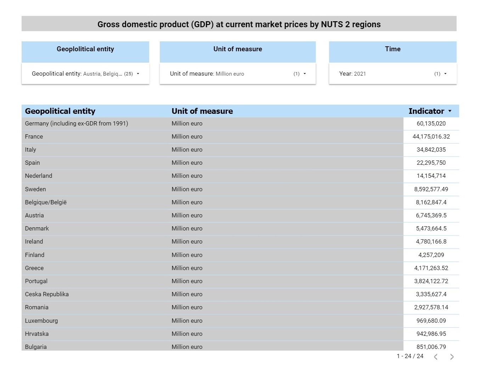
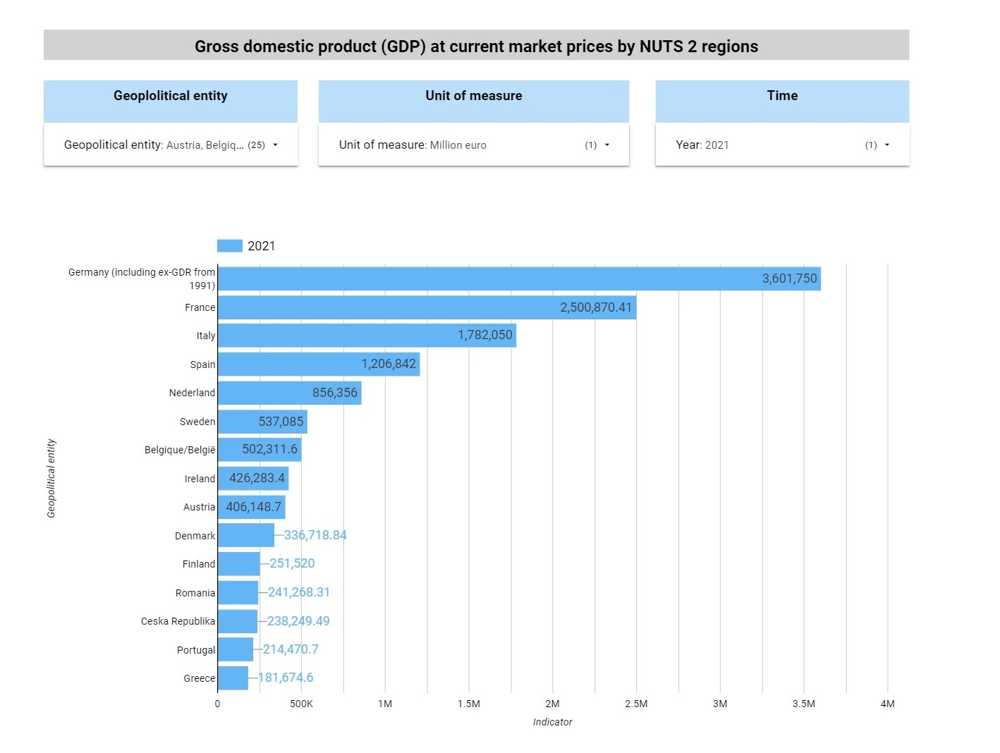
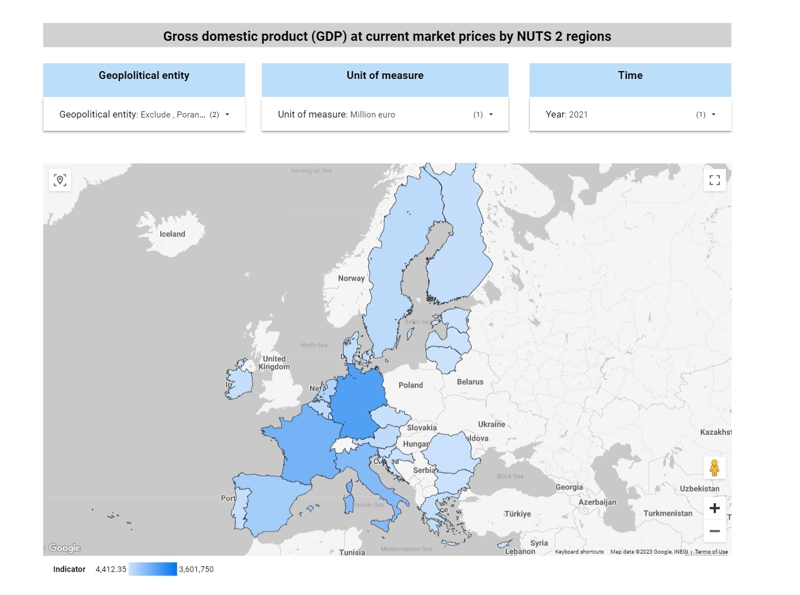
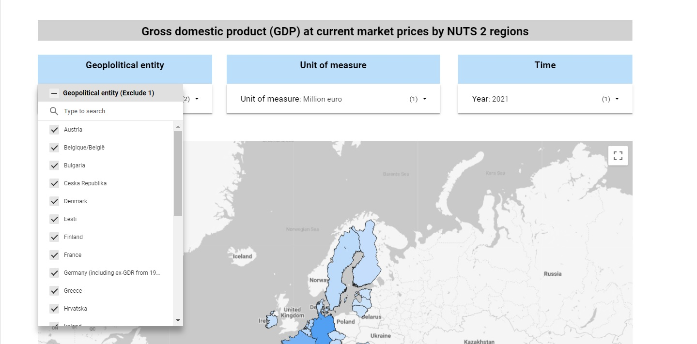
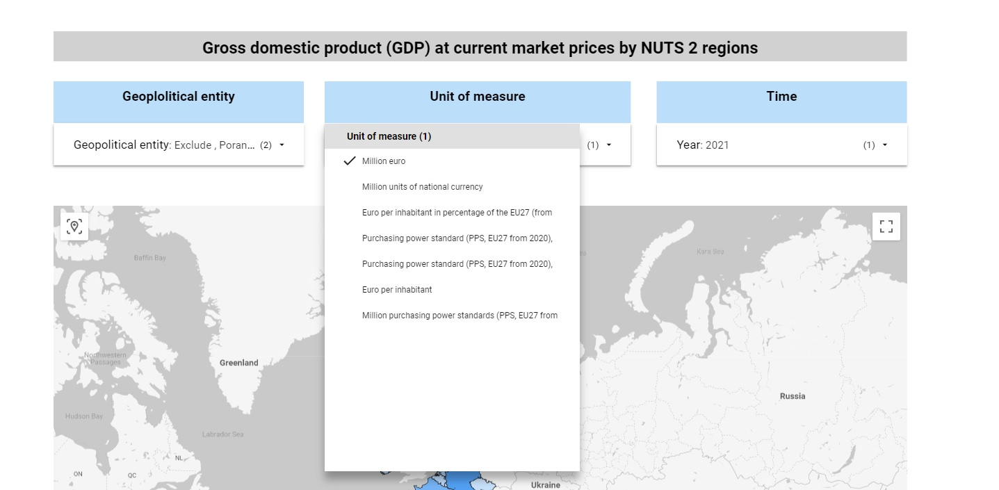
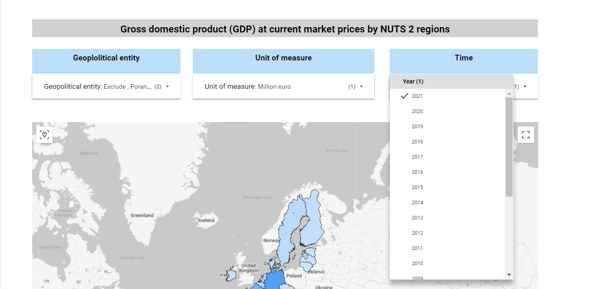

>[Back to index](../README.md)

# Dashboard visualizations

The dashboard consist of tree pages: Table, Bar, Map.

**Table:**

**Bar:**

**Map:**

Each page contains three drop boxes with the input parameters:

**Geoplolitical entity:**

**Unit of measure:**

**Time:**

