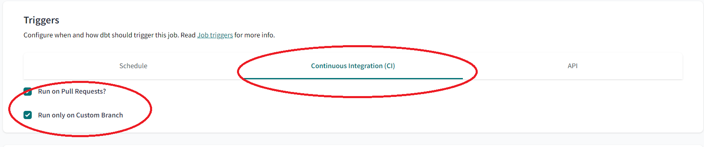

>[Back to index](../README.md)

# dbt part implementation details and model deployment guidance

This document contains details of the implementation of the dbt part of the project.

# Index
- [General suppositions](#general-suppositions)
- [Configuration steps](#configuration-steps)
  - [1. Setting up dbt Cloud project](#1-setting-up-dbt-cloud-project)
  - [2. Setting up GitHub repository](#2-setting-up-github-repository)
  - [3. Configure dev environment](#3-configure-dev-environment)
  - [4. Configure ci environment](#4-configure-ci-environment)
  - [5. Configure qa environment](#5-configure-qa-environment)
  - [6. Configure prod environment](#6-configure-prod-environment)
  - [7. Configure the dbt project documentation building](#7-configure-the-dbt-project-documentation-building)
  - [8. Adjust dbt models](#8-adjust-dbt-models)
- [The project team workflow](#the-project-team-workflow)

# General suppositions.
- It is supposed that the dbt project team contains separate dev and qa teams.
- It is supposed that the dbt project has 3 basic environments: dev, qa and prod.
- It is supposed that the dbt project has 1 additional continuous integration environment: ci. 
- It is supposed that each basic environment contains its own GitHub branch and DB schemas.
  - dev environment contains:
      - GitHub branch: `dbt-dev`
      - DB schema: `eurostat_gdp_dev`
  - qa environment contains:
      - GitHub branch: `dbt-qa` 
      - DB schemas: `eurostat_gdp_qa_staging` and `eurostat_gdp_qa_core`. Intermediate non-core DB objects are carried over into the separate staging schema in order to simplify the work of the end-users.
  - prod environment contains:
      - GitHub branch: `dbt-prod`. This branch is used to separate dbt code from the other code in the repository which is stored in the main branch. 
      - DB schemas: `eurostat_gdp_prod_staging` and `eurostat_gdp_prod_core`. Intermediate non-core DB objects are carried over into the separate staging schema in order to simplify the work of the end-users.
- It is supposed that a continuous integration job will run when a pull request will be created in **dbt-dev** branch in order to merge changes to the **dbt-qa** branch.
- It is supposed that objects in the **eurostat_gdp_dev** DB schema will be created when a developer will run the corresponding dbt commands in the dbt Cloud IDE during the development proccess.
- It is supposed that objects in the **eurostat_gdp_qa** and **eurostat_gdp_prod** DB schemas will be created when the corresponding deployment jobs will be launched manually or through the dbt Cloud scheduler.
- The listed above suppositions take into account some limitations for the free dbt Cloud pricing plan which is used for this project. 
- The following configuration steps reflect these suppositions.

# Configuration steps
## 1. Setting up dbt Cloud project.
1. Create a [dbt CLoud account](https://www.getdbt.com/signup/) or login to an existing account.
2. Go to **_Account Settings_** -> **_User Profile_** -> **_Personal Profile_** -> **_Linked Accounts_** -> **_Link_** -> **_Authorize dbt Cloud_**
      - Under choosen linked repo account -> Configure integration in GitHub -> Install dbt Cloud -> Install
3. Create a new project in this account: **Account Settings -> Projects -> New Project**
    - **_Project name:_** `eurostat-gdp`
    - **_Advanced Settings -> Project subdirectory_**. Specify the subdirectory of your repository which will contains your dbt project. For details see the following [guide](https://docs.getdbt.com/docs/build/projects#project-subdirectories).
    - Choose a connection: `BigQuery`
    - Configure your environment:
      - **_Connection:_** `BigQuery`
      - Upload a `Service Account JSON file`
      - **_Optional Settings_** section, enter the preferred value in the field **_Location_**. It is a GCP Location where dbt will create new Datasets for your project, i.e `us-east1`.
      - **_Development credentials_** section, field **_Dataset:_** `eurostat_gdp`. 
      - Test the connection and click on **_Continue_** once the connection is tested successfully.
    - Setup a Repository for the dbt project.
      - Choose the corresponding Repository from the provided list. This list is formed based on the information from your Repo account which is linked to your dbt User Profile.

  
## 2. Setting up GitHub repository.
In the selected GitHub repository create the following branches: 
- `dbt-dev`. This is the individual branch of the developer. Each developer from dev team has its own developing branch.
- `dbt-qa`. This branch contains all merged changes from the whole dev team.
- `dbt-prod`. It is actually branch for prod environment.

## 3. Configure dev environment.
- Open dbt Cloud IDE.
- Setup working branch for the IDE: `dbt-dev`
  
    
- Open **_Account Settings_** -> **_User Profile_** -> **_Credentials_** -> **_Development Credentials_**
- Setup **Dataset:** `eurostat_gdp` and **Target Name:** `dev`.

    

## 4. Configure ci environment.
1. Create continuous integration deployment environment: **_Deploy_** -> **_Environments_** -> **_Create Environment_**  
   Setup the values provided on the following picture during the creation:

    

2. Create Deployment job in the created CI environment: **_Deploy_** -> **_Jobs_** -> **_Create Job_**  
   Setup the values provided on the following pictures during the creation:

    

    

    

## 5. Configure qa environment.
1. Create qa deployment environment: **_Deploy_** -> **_Environments_** -> **_Create Environment_**  
   Setup the values provided on the following picture during the creation:

    

2. Create Deployment job in the created QA environment: **_Deploy_** -> **_Jobs_** -> **_Create Job_**  
   Setup the values provided on the following pictures during the creation:

    

    

    You could disable dbt Cloud scheduler as on the following picture, or setup the corresponding values for the scheduler - doesn't matter.
    

## 6. Configure prod environment.
1. Create prod deployment environment: **_Deploy_** -> **_Environments_** -> **_Create Environment_**  
   Setup the values provided on the following picture during the creation:

    

2. Create Deployment job in the created Production environment: **_Deploy_** -> **_Jobs_** -> **_Create Job_**  
   Setup the values provided on the following pictures during the creation:

    

    

    You could disable dbt Cloud scheduler as on the following picture, or setup the corresponding values for the scheduler - doesn't matter.
    

## 7. Configure the dbt project documentation building

- Set up a documentation job.  
  - The process of creation of dbt project documentation could be tied to any existing jobs in the project. But in this project for the documentation creation a separate job is used.
  - Create Deployment job in the Production environment: Deploy -> Jobs -> Create Job  
    Setup the values provided on the following pictures during the creation:

    

      
    
- Configure project documentation.

  - Go to Account Settings -> Project -> Artifacts
  - In the field `Documentation` select the documentation job created on the previous step
 
    
    
- The official guidance you can find at this link: [Build and view your docs with dbt Cloud.](https://docs.getdbt.com/docs/collaborate/build-and-view-your-docs#set-up-a-documentation-job)

## 8. Adjust dbt models
- Adjust the models from the forked repository providing your own values:
  - `cd eurostat-gdp-airflow/dbt/models/staging`
  - edit `schema.yaml' - find the value: `database: free-tier-project-397608`. Replace this value by your own Big Query database name.

# The project team workflow.
- Each developer from the dev team implements changes in the own `dbt-dev` branch. During the implementation process dbt creates the corresponding objects in the DB schema `eurostat_gdp_dev`.
- After the completion of the implementation the developer commits changes in the repo and creates the pull request to merge changes from the `dbt-dev` to the `dbt-qa` branch.
- dbt Cloud will launch the continuous integration job `CI Check`.
- If the previous step passed without any issues, the developer mannually launch the job `Deploy to QA`. This job will create/update the corresponding objects in the `eurostat_gdp_qa_staging` and `eurostat_gdp_qa_core` schemas.
    - _`The job launched manually due to limitations for the free dbt Cloud pricing plan. This plan doesn't allow the using of dbt Cloud API Access.`_
    - _`The alternative solution for other pricing plans you can find` [here.](https://docs.getdbt.com/guides/orchestration/custom-cicd-pipelines/3-dbt-cloud-job-on-merge)_
- QA team begins their work.
- If there are no issues were found by the qa team, the new pull request should be created in GitHub in the `dbt-qa` branch to merge changes into the `dbt-prod` branch.
- If the previous step passed without any issues, the developer(or qa) mannually launch the job `Deploy to Prod`. This job will create/update the corresponding objects in the `eurostat_gdp_prod_staging` and `eurostat_gdp_prod_core` schemas.
- In order to keep the whole repository in the up-to-date state, once more pull request should be created in the `dbt-prod` branch in order to merge all changes to the `main` branch.
